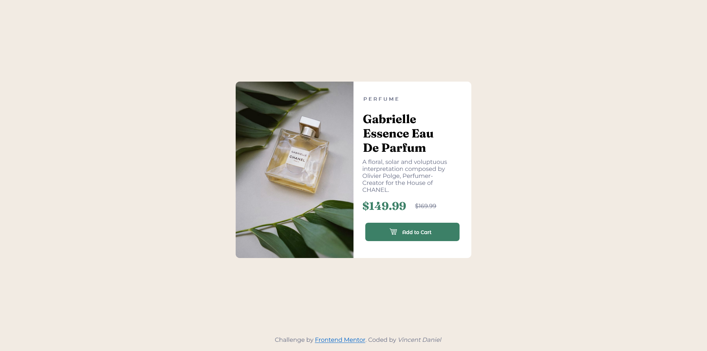

# Frontend Mentor - Product preview card component solution

This is a solution to the [Product preview card component challenge on Frontend Mentor](https://www.frontendmentor.io/challenges/product-preview-card-component-GO7UmttRfa). Frontend Mentor challenges help you improve your coding skills by building realistic projects. 

## Table of contents

- [Overview](#overview)
  - [The challenge](#the-challenge)
  - [Screenshot](#screenshot)
  - [Built with](#built-with)
  - [Continued development](#continued-development)
  - [Useful resources](#useful-resources)
- [Author](#author)

## Overview
This project comprises of basic html and css. You must be able to adequately use the flex display for merging both the dominant image and the sibling "div", in order to maintain a good layout of your design on the interface.

### The challenge

Users should be able to:

- View the optimal layout depending on their device's screen size
- See hover and focus states for interactive elements

### Screenshot

### Built with

- Semantic HTML5 markup
- CSS custom properties
- Flexbox

### Continued development

Focusing relatively on a better application of the Flexbox property and the features that come with it in more realtime webpages. This would enable me to provide outstanding layouts for images, svgs, containers etc.

### Useful resources

- [Example resource 1](https://www.stackoverflow.com) - This helped me for finding better ways of replacing image classes when moving from a desktop layout to a mobile layput and vice versa.
- [Example resource 2](https://www.developer.mozilla.org) - This is an amazing article which helped me finally understand transitionng during hover effects. I'd recommend it to anyone still learning this concept.

## Author
- Frontend Mentor - [@davinceey](https://www.frontendmentor.io/profile/davinceey)
